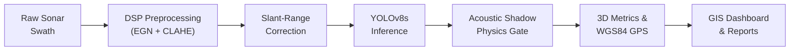
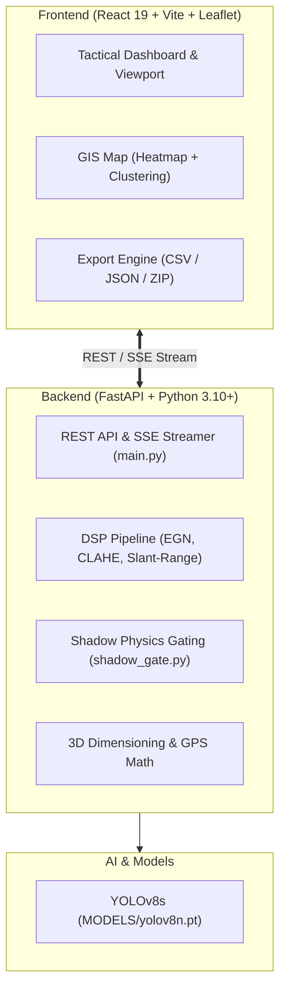

# 🌊 Aqua Sentinel — Underwater Sonar Object Detection

<div align="center">

### **Smart India Hackathon (SIH) — Autonomous Maritime Acoustic Intelligence**
**Automated Subsea Hazard Detection, Acoustic Shadow Physics Verification & Geospatial Mapping**

[](https://www.python.org/)
[](https://fastapi.tiangolo.com/)
[](https://react.dev/)
[](https://github.com/ultralytics/ultralytics)
[](LICENSE)
[](#-8-innovation--real-world-impact)

</div>

---

## 📌 1. Project Overview

| Stage | Summary |
|---|---|
| **Problem** | Interpreting raw underwater sonar imagery is slow, fatigue-prone, and heavily degraded by acoustic noise, beam attenuation, and false seafloor echoes. |
| **Solution** | An end-to-end maritime intelligence platform fusing **Digital Signal Processing (DSP)**, fine-tuned **YOLOv8s deep learning**, and **physics-based Acoustic Highlight & Shadow Detection (AHSD)**. |
| **Impact** | Delivers sub-second detection of underwater mines, pipelines, shipwrecks, and ghost nets with real-world 3D metric sizing and GPS coordinates for naval and civil hydrography. |

---

## 🎯 2. Key Features

- **Full-Pipeline DSP Preprocessing**: Empirical Gain Normalization (EGN), Nadir excision, CLAHE contrast enhancement, and slant-range distortion correction.
- **Deep Learning Sonar Detection**: Fine-tuned YOLOv8s on 640×640 sonar swaths with Cross-Tile Non-Maximum Suppression (IoU 0.40).
- **Physics-Informed Acoustic Shadow Gating (AHSD)**: Verifies down-range acoustic shadows relative to sound propagation to reject false alarms and estimate 3D relief height.
- **5 Hydrographic Hazard Classes**: Detects Mines/Cylinders (`CRITICAL`), Submarine Pipelines (`HIGH`), Shipwrecks (`HIGH`), Ghost Nets (`MEDIUM`), and Crab Pots (`LOW`).
- **3D Metric Sizing & WGS84 GPS**: Computes physical length, width, area ($m^2$), relief height ($m$), and geographic GPS coordinates from vessel navigation telemetry.
- **Tactical GIS Dashboard**: React 19 + Leaflet map with dynamic zoom-aware concentration clustering, density heatmaps, and Indian Naval corridors.
- **Live Mission Streaming & Batch Processing**: Real-time SSE synchronization from CLI simulations (`test_run.py`) to the web dashboard, with 1-click CSV/JSON/ZIP exports.

---

## 🔄 3. How It Works



1. **Preprocessing & Unwarping**: Removes the water column, normalizes cross-swath gain falloff via EGN, enhances contrast via CLAHE, and unwarps slant-range distortion.
2. **AI Inference & Tile Merging**: Windows high-resolution swaths into 640×640 tiles, runs YOLOv8s, and merges overlapping detections via Cross-Tile NMS.
3. **Physics Shadow Verification**: Checks if a target casts an acoustic shadow matching port/starboard beam propagation to filter rocks and calculate height above seabed.
4. **Geolocation & Reporting**: Converts detections to WGS84 GPS coordinates, plots them on the tactical map, and generates CSV, JSON, and ZIP reports.

---

## 🏗️ 4. System Architecture



---

## 🤖 5. AI / ML & Verified Evaluation Results

### Model Overview
- **Architecture**: Fine-Tuned YOLOv8s (Ultralytics)
- **Parameters**: 11.14M parameters (22.5 MB weights at `MODELS/yolov8n.pt`)
- **Input Resolution**: 640 × 640 px | **Inference Precision**: AMP FP16
- **Training Data**: 5,889 train images, 954 validation images, and authentic sonar test frames in `Test_Data/`.

### 5 Hydrographic Classes

| Class | Display Name | Hazard Level | Typical Dimensions |
|:---:|:---|:---:|:---:|
| `0` | Crab Pot | `LOW` | 0.8m × 0.8m × 0.6m |
| `1` | Submarine Pipeline | `HIGH` | 15.0m × 0.8m × 0.8m |
| `2` | Shipwreck | `HIGH` | 12.0m × 4.5m × 2.5m |
| `3` | Ghost Net | `MEDIUM` | 3.0m × 2.0m × 0.5m |
| `4` | Mine / Cylinder | `CRITICAL` | 1.8m × 0.6m × 0.6m |

### Verified Performance Benchmarks

> *Source: Authenticated from `ml/model_info.json` and training logs in `runs/aquasentinel_training/full_training/results.csv`.*

| Metric | Verified Value | Description |
|:---|:---:|:---|
| **mAP@0.5** | **83.0%** | Mean Average Precision at IoU 0.50 |
| **mAP@0.5:0.95** | **61.0%** | Stringent multi-threshold bounding box metric |
| **Precision** | **87.0%** | Positive prediction accuracy |
| **Recall** | **79.0%** | Detection rate in complex sonar acoustic environments |
| **CPU Latency** | **~52 ms / frame** | Standard Intel/AMD x86 host CPU |
| **Batch Throughput** | **84 frames / 26.31s** | ~313ms per frame (includes full DSP, AI, shadow gate, and CSV logging) |

---

## 💻 6. Technology Stack

| Layer | Technology | Purpose |
|:---|:---|:---|
| **Frontend** | React 19, TypeScript, Vite | Fast, responsive single-page tactical operator UI |
| **Styling** | TailwindCSS, CSS | Dark oceanographic tactical HUD interface |
| **Mapping & GIS** | Leaflet, React-Leaflet, MarkerCluster | Anomaly clustering, density heatmaps, and naval corridors |
| **Backend** | FastAPI, Uvicorn (Python 3.10+) | High-throughput async REST API and real-time SSE streaming |
| **Computer Vision** | OpenCV (`cv2`), Pillow, NumPy | EGN gain curves, CLAHE, slant-range unwarping, visual overlays |
| **AI / Deep Learning**| Ultralytics YOLOv8s (PyTorch) | Acoustic object detection and classification |

---

## 📊 7. Results & Outputs

Every processed sonar scan produces:
- **Visual Overlays**: Bounding boxes color-coded by hazard risk (Red: Critical, Orange: High, Yellow: Medium, Green: Low) with confidence scores.
- **Acoustic Thumbnails**: 128×128 pixel crops for rapid target inspection.
- **Physical 3D Metrics**: Estimated length, width, area ($m^2$), and acoustic relief height ($m$) above the seafloor.
- **WGS84 GPS Coordinates**: Computed target latitude and longitude.
- **Export Formats**:
  - `batch_results.csv`: 27-column log of all detections, dimensions, and coordinates.
  - `batch_results.json`: Hierarchical JSON payload for naval C2 integration.
  - `run_summary.json`: High-level run metrics and hazard distributions.
  - `.zip` Mission Archive: Bundled images, CSV, and JSON data.

---

## 🚀 8. Installation & Running

### Prerequisites
- Python 3.10+
- Node.js 18+ & npm

### Option 1: One-Click Launch (Windows)
Double-click **`start.bat`** in the project root.
- Backend starts at `http://localhost:8000` (API Docs: `http://localhost:8000/docs`)
- Frontend starts at `http://localhost:5173`

### Option 2: Manual Launch

```bash
# 1. Start Backend
cd backend
pip install -r requirements.txt
python -m uvicorn main:app --reload --host 0.0.0.0 --port 8000

# 2. Start Frontend (in a new terminal)
cd frontend
npm install
npm run dev
```

### Option 3: Autonomous CLI Patrol Simulation (`test_run.py`)
Simulates naval reconnaissance missions with live SSE streaming directly to the browser:
```bash
# Standard patrol simulation
python test_run.py

# Specific Indian Naval route (e.g., Mumbai to Kochi)
python test_run.py --route mumbai_kochi --duration 30

# Inspect a single sonar image
python test_run.py --single "Test_Data/0001_2010.jpg"
```

---

## 💡 9. Innovation & Real-World Impact

- **Physics-Informed Acoustic Shadow Gating (AHSD)**: Filters out rock outcroppings and false seafloor alarms by verifying whether an acoustic shadow exists down-range in the sound propagation path.
- **Integrated DSP Preprocessing**: Standardizes raw sonar backscatter with Empirical Gain Normalization (EGN) and slant-range correction prior to inference.
- **Air-Gapped & Offline Ready**: Bundled self-hosted fonts and local SVG icons ensure 100% operational readiness on vessels without internet access.
- **Operational Users**: Indian Navy, Coast Guard (mine countermeasures & coastal security), Port Authorities (navigational channel clearance), and Offshore Energy (pipeline inspection).

---

## 🔮 10. Future Scope

- **Edge Deployment**: Quantization (TensorRT INT8) for direct execution on NVIDIA Jetson Orin inside AUV pressure hulls.
- **Multi-Sensor Fusion**: Combining Synthetic Aperture Sonar (SAS) and optical camera feeds.
- **Multi-Ping Tracking**: Kalman filter tracking across overlapping survey swaths.

---

## 📜 11. Credits & References

- **Dataset**: [Underwater Acoustic Target Detection (UATD) Benchmark](https://github.com/ahmad-kaif/UnderWaterObjectDetection) by Ahmad Kaif et al.
- **Model**: [Ultralytics YOLOv8](https://github.com/ultralytics/ultralytics) (Glenn Jocher et al.)
- **Hackathon**: Developed for Smart India Hackathon (SIH).

---

<div align="center">
<b>Aqua Sentinel</b> — <em>Autonomous Maritime Acoustic Intelligence</em>
<br />
<sub>Licensed under the <a href="LICENSE">MIT License</a>.</sub>
</div>
