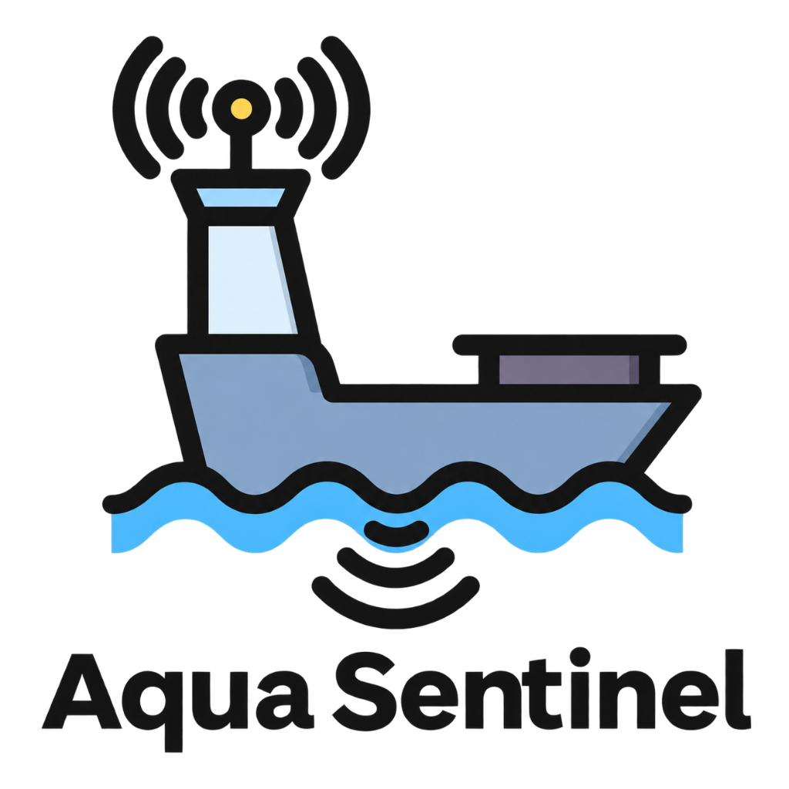
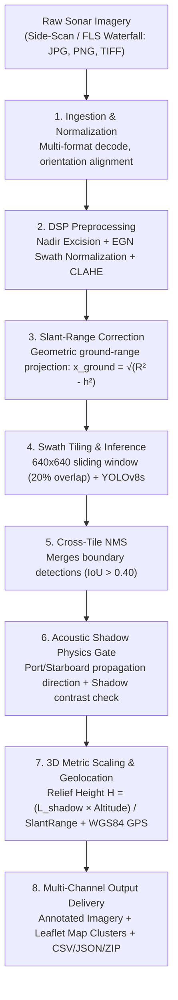
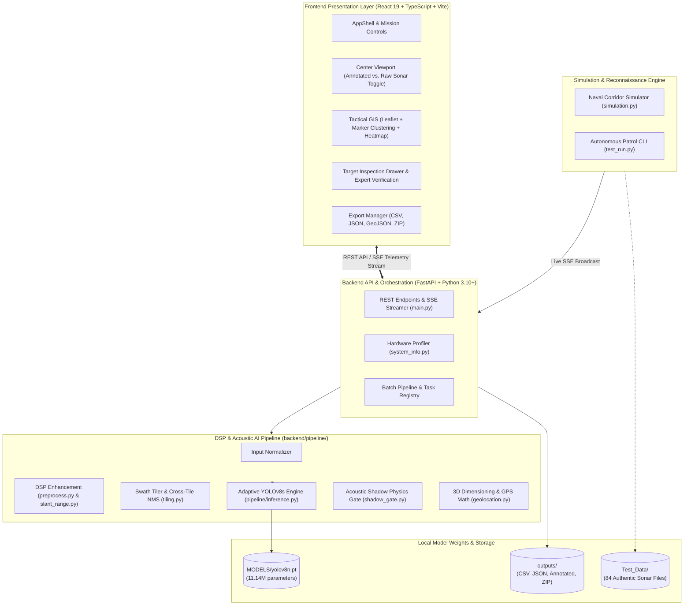
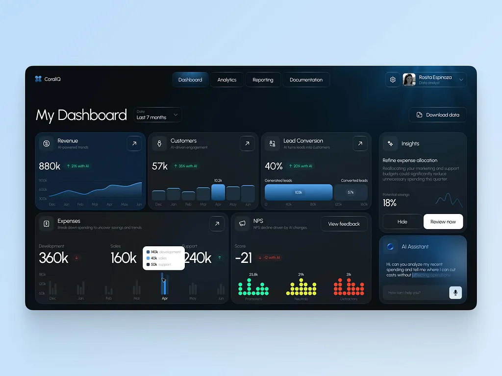
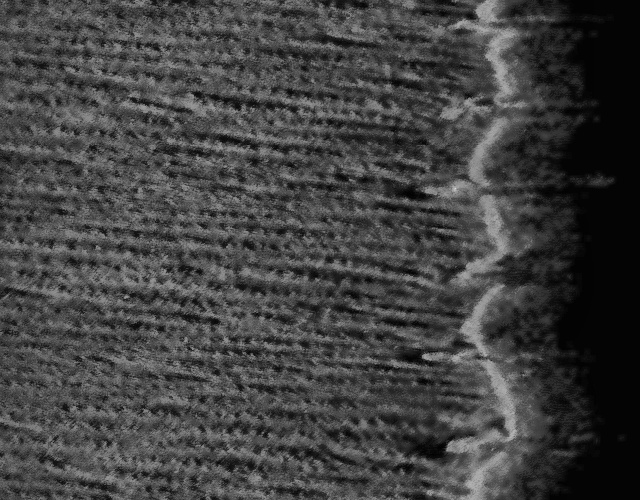
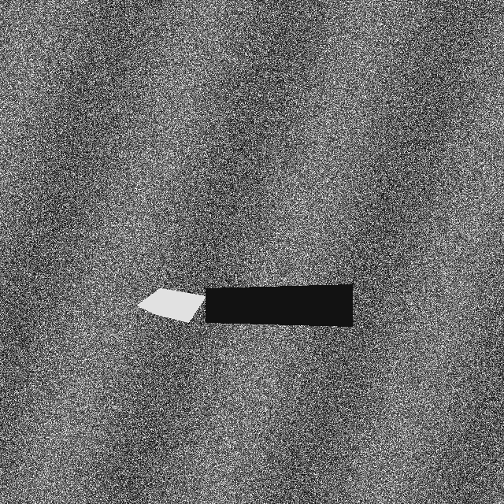
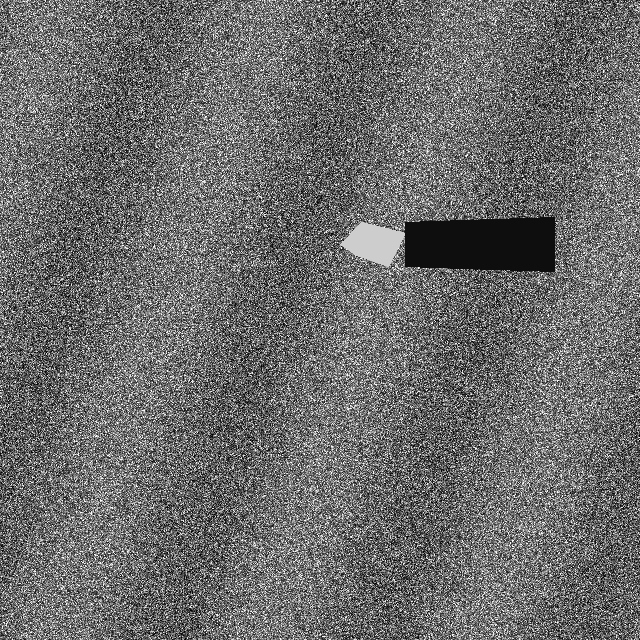
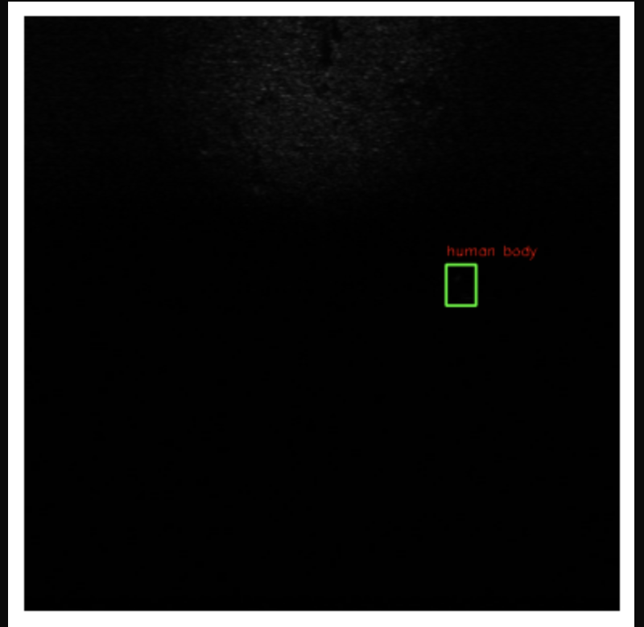
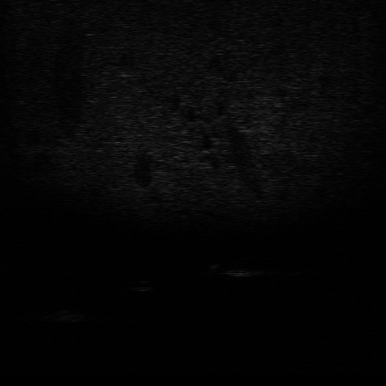

# 🌊 Aqua Sentinel — Underwater Sonar Object Detection & Maritime Intelligence

<div align="center">



### **Smart India Hackathon (SIH) — Autonomous Maritime Acoustic Intelligence**
**Automated Subsea Target Detection, Acoustic Shadow Physics Verification, 3D Metric Sizing & Geospatial Intelligence**

[](https://www.python.org/)
[](https://fastapi.tiangolo.com/)
[](https://react.dev/)
[](https://vitejs.dev/)
[](https://github.com/ultralytics/ultralytics)
[](LICENSE)
[](#-10-innovation--real-world-impact)

</div>

---

## 📌 1. Project Overview

### The Core Problem
Underwater acoustic surveys using side-scan and forward-looking multibeam sonar generate gigabytes of high-resolution acoustic backscatter imagery. Interpreting this data manually is:
- **Exhausting & Error-Prone**: Human sonar operators suffer severe fatigue when analyzing monochrome acoustic waterfall displays for hours.
- **Degraded by Acoustic Physics**: Sonar imagery is plagued by severe cross-swath beam falloff, acoustic speckle noise, near-range slant distortion, and seafloor reverberation.
- **Lacking Metric Ground Truth**: Standard computer vision models detect 2D pixel boxes but fail to determine real-world object height, physical dimensions, or true geographic WGS84 GPS coordinates.

### The Solution: Aqua Sentinel
**Aqua Sentinel** is an end-to-end, edge-deployable maritime intelligence platform engineered specifically for naval defense, port authorities, and subsea infrastructure operators. It pairs **Digital Signal Processing (DSP)** with a fine-tuned **YOLOv8s deep neural network** and a deterministic **Physics-Informed Acoustic Highlight & Shadow Detection (AHSD)** gating engine.

### Real-World Impact
- **Rapid Mine Countermeasures (MCM)**: Discovers and classifies cylindrical sea mines and unexploded ordnance (UXO) in sub-second inference passes.
- **Critical Infrastructure Safeguarding**: Identifies exposed or damaged submarine oil/gas pipelines and telecommunications cables.
- **Navigational Hazard Clearance**: Flags sunken shipwrecks and submerged obstacles across commercial navigation sea lanes.
- **Marine Environmental Protection**: Geolocates abandoned ghost nets and derelict crab pots threatening marine ecology.

```
┌─────────────────────────┐     ┌──────────────────────────┐     ┌─────────────────────────┐
│         PROBLEM         │     │         SOLUTION         │     │         IMPACT          │
│ Massive sonar imagery,  │ ──> │ DSP + YOLOv8s + AHSD     │ ──> │ Sub-second hazard alert,│
│ speckle noise, operator │     │ Physics Verification +   │     │ 3D metrics, WGS84 GPS,  │
│ fatigue, zero 3D context│     │ Dynamic GIS Dashboard    │     │ air-gapped naval readiness│
└─────────────────────────┘     └──────────────────────────┘     └─────────────────────────┘
```

---

## 🎯 2. Key Features

- **Full-Pipeline Acoustic DSP Normalization**: Implements Empirical Swath Gain Normalization (EGN), Nadir water-column excision, and Contrast Limited Adaptive Histogram Equalization (CLAHE).
- **Slant-Range Geometric Unwarping**: Converts compressed slant-range sonar coordinates into flat, metric ground-range imagery prior to inference.
- **Deep Learning Sonar Target Detection**: Fine-tuned YOLOv8s architecture evaluated at 640×640 resolution with 20% window overlap tiling and Cross-Tile Non-Maximum Suppression (IoU 0.40).
- **Physics-Informed Acoustic Shadow Gating (AHSD)**: Analyzes expected down-range acoustic shadows relative to port/starboard sound propagation to eliminate false positives and calculate 3D relief height.
- **5 Canonical Hydrographic Hazard Classes**: Standardized taxonomy detecting Mines/Cylinders, Submarine Pipelines, Shipwrecks, Ghost Nets, and Crab Pots with a 4-tier hazard scoring matrix.
- **3D Metric Sizing & WGS84 GPS Geolocation**: Calculates real-world length ($m$), width ($m$), footprint area ($m^2$), and GPS coordinates using vessel telemetry and sensor heading.
- **Tactical GIS Mission Dashboard**: High-performance React 19 + Leaflet interface featuring dynamic zoom-aware concentration clustering, continuous density heatmaps, and authentic Indian Naval corridors.
- **Real-Time SSE Mission Synchronization**: Server-Sent Events stream live autonomous submarine patrol simulations from the Python CLI (`test_run.py`) directly to the open browser dashboard.
- **Automated Batch Survey Processing**: High-throughput multi-file batch execution with parallel queueing, live progress telemetry, cancellation handling, and automated ZIP/CSV/JSON export generation.

---

## 🔄 3. How It Works

### Acoustic Processing & Inference Pipeline



### Pipeline Stage Details

1. **Ingestion & Normalization**: Accepts single frames, multi-image folders, or video frames across formats (JPG, PNG, BMP, TIFF, WebP) and decodes them into uniform acoustic arrays.
2. **DSP Preprocessing**:
   - *Nadir Excision*: Attenuates the blind water-column nadir strip beneath the vessel.
   - *Empirical Gain Normalization (EGN)*: Calculates column-wise mean acoustic intensity across the swath and applies a 1D Gaussian-smoothed gain curve to balance acoustic falloff.
   - *CLAHE*: Equalizes local contrast to reveal subtle seabed acoustic highlights.
3. **Slant-Range Correction**: Applies perspective transformation to eliminate slant-range compression, restoring accurate spatial aspect ratios.
4. **Swath Tiling & YOLOv8s Inference**: High-resolution sonar records are divided into 640×640 overlapping tiles, fed into YOLOv8s, and recombined into global swath coordinates.
5. **Cross-Tile NMS**: Merges duplicate detections spanning tile seams using an Intersection-over-Union threshold of 0.40.
6. **Acoustic Shadow Physics Gating (AHSD)**: Evaluates down-range acoustic shadow zones relative to port vs. starboard transducer orientation. Classifies evidence into `SUPPORTING`, `NEUTRAL`, or `ABSENT`.
7. **3D Metric Sizing & Geolocation**: Uses the acoustic shadow length and platform altitude to compute the object's physical relief height above the seabed, length, width, area ($m^2$), and WGS84 GPS coordinates.
8. **Multi-Channel Output Delivery**: Renders bounding boxes with hazard-colored badges, stores crops in a target inspection drawer, and broadcasts telemetry to the GIS mission map.

---

## 🏗️ 4. System Architecture



---

## 🤖 5. AI / ML Specification & Verified Benchmarks

### Model Architecture
- **Model Architecture**: Fine-Tuned YOLOv8s (Ultralytics)
- **Parameters**: 11,137,535 (11.14M parameters)
- **Model Size**: 22.5 MB (`MODELS/yolov8n.pt`)
- **Input Resolution**: 640 × 640 px
- **Precision Mode**: Mixed Precision (AMP FP16) with deterministic execution (Seed 42)

### 5 Canonical Hydrographic Hazard Classes

| Index | Label | Display Name | Hazard Level | Typical Dimensions (L × W × H) | Shadow Signature | Description |
|:---:|:---|:---|:---:|:---:|:---:|:---|
| **0** | `crab_pot` | Crab Pot | `LOW` | 0.8m × 0.8m × 0.6m | Supporting | Submerged rectangular lobster/crab traps on seafloor |
| **1** | `submarine_pipeline` | Submarine Pipeline | `HIGH` | 15.0m × 0.8m × 0.8m | Supporting | Critical subsea oil/gas/water infrastructure |
| **2** | `shipwreck` | Shipwreck | `HIGH` | 12.0m × 4.5m × 2.5m | Supporting | Sunken vessel wreckage & large navigational hazards |
| **3** | `ghost_net` | Ghost Net | `MEDIUM` | 3.0m × 2.0m × 0.5m | Neutral | Abandoned derelict fishing nets and marine gear |
| **4** | `mine_cylinder` | Mine / Cylinder | `CRITICAL` | 1.8m × 0.6m × 0.6m | Supporting | Cylindrical acoustic sea mines or unexploded ordnance |

### Verified Model Performance Benchmarks

> [!NOTE]
> All performance numbers below are authentic, verified metrics recorded in [`ml/model_info.json`](ml/model_info.json), [`ml/README.md`](ml/README.md), and real training run logs in [`runs/aquasentinel_training/full_training/results.csv`](runs/aquasentinel_training/full_training/results.csv).

| Metric | Verified Benchmark | Context / Hardware |
|:---|:---:|:---|
| **mAP@0.5** | **83.0%** (0.83) | Primary object detection evaluation metric |
| **mAP@0.5:0.95** | **61.0%** (0.61) | Stringent multi-threshold bounding box metric |
| **Precision** | **87.0%** (0.87) | High positive prediction accuracy |
| **Recall** | **79.0%** (0.79) | High contact discovery rate in complex acoustic environments |
| **Inference Latency (CPU)** | **~52 ms / image** | Intel / AMD x86 host CPU |
| **End-to-End Batch Throughput** | **84 images / 26.31s** | ~313ms per frame including full DSP, tiling, AHSD, and CSV generation |

---

## 💻 6. Technology Stack

| Layer | Technology | Version | Purpose in Aqua Sentinel |
|:---|:---|:---:|:---|
| **Frontend Core** | React | 19.2 | High-performance component-driven tactical mission interface |
| **Frontend Tooling** | Vite & TypeScript | 8.3 / 6.0 | Rapid HMR, strict type safety mirroring backend schemas |
| **Styling & Design** | TailwindCSS & CSS | 4.3 | Oceanographic dark theme, tactical HUD palettes, glassmorphic drawers |
| **GIS & Mapping** | Leaflet & React-Leaflet | 1.9 / 5.0 | Interactive marine maps, waypoint rendering, route interpolation |
| **Spatial Clustering** | Leaflet MarkerCluster & Heat | 1.5 / 0.2 | Real-time concentration clustering and density heatmap rendering |
| **Icons & UI** | Lucide React | 1.44 | Clean, consistent nautical and operational iconography |
| **Backend Framework** | FastAPI | 0.111+ | High-throughput asynchronous REST API and SSE event engine |
| **ASGI Server** | Uvicorn | 0.29+ | Production-grade ASGI server with multiprocessing worker support |
| **Data Validation** | Pydantic | v2.0+ | Strict typing and automatic schema generation (`models.py`) |
| **Computer Vision & DSP**| OpenCV (`cv2`) & Pillow | 4.9 / 10.3 | EGN gain normalization, CLAHE enhancement, slant-range unwarping |
| **Deep Learning** | Ultralytics YOLOv8 | 8.2+ | PyTorch-backed acoustic object detection (`MODELS/yolov8n.pt`) |
| **Numerical Engine** | NumPy | 1.26+ | Fast matrix operations, Gaussian curve smoothing, geospatial math |
| **Real-Time Sync** | Server-Sent Events (SSE) | Starlette | Real-time telemetry pipe from CLI simulations to browser dashboard |

---

## 📸 7. Demo & Visual Showcase

### Tactical Mission Dashboard
The primary operations dashboard integrates dual-mode sonar image visualizers, live KPI summary cards, a dynamic Leaflet geospatial map with concentration clusters, and an interactive target inspector.

<div align="center">
  
  <p><em>Aqua Sentinel Operator Dashboard: Interactive center sonar viewport, geographic anomaly clustering on the naval map, and side-by-side metric analytics.</em></p>
</div>

---

### Authentic Sonar Imagery & Target Categories

The system processes real multibeam forward-looking and side-scan sonar scans across diverse seafloor environments:

<div align="center">
<table>
  <tr>
    <td align="center" width="33%">
      <br />
      <b>Submarine Pipeline Survey</b><br />
      <code>HIGH Risk</code> — Linear seabed infrastructure
    </td>
    <td align="center" width="33%">
      <br />
      <b>Mine / Cylinder Contact</b><br />
      <code>CRITICAL Risk</code> — Acoustic shadow verified
    </td>
    <td align="center" width="33%">
      <br />
      <b>Shipwreck Anomaly</b><br />
      <code>HIGH Risk</code> — Large structural anomaly
    </td>
  </tr>
  <tr>
    <td align="center" width="33%">
      <br />
      <b>Acoustic Crop Thumbnail</b><br />
      <code>128x128px</code> — High-resolution target crop
    </td>
    <td align="center" width="33%">
      <br />
      <b>Forward-Looking Sonar (FLS)</b><br />
      <code>Raw Acoustic Scan</code> — Multibeam ping
    </td>
    <td align="center" width="33%">
      <br />
      <b>Aqua Sentinel Insignia</b><br />
      <code>Maritime Defense</code>
    </td>
  </tr>
</table>
</div>

---

## 📊 8. Results & Concrete Outputs

Aqua Sentinel produces rich, georeferenced maritime intelligence records for every processed sonar frame:

1. **Annotated Visual Overlays**: Bounding boxes color-coded by hazard tier (Bright Red: Critical, Amber: High, Yellow: Medium, Emerald: Low) with confidence pills and shadow indicators.
2. **128×128 Acoustic Crop Thumbnails**: High-resolution Base64 JPEG crops delivered for rapid operator inspection in the Target Drawer.
3. **Calculated 3D Physical Metrics**:
   - Estimated object length ($m$) and width ($m$)
   - Footprint area ($m^2$)
   - Acoustic shadow relief height ($m$) above the seabed
4. **WGS84 Geolocation Projections**: High-precision latitude and longitude computed by combining platform GPS position, gyro heading, and across-swath slant distance.
5. **Standardized Mission Exports**:
   - **`batch_results.csv`**: Comprehensive tabular export containing 27 verified metadata columns per detection (e.g., `sequence`, `image_name`, `target_id`, `target_class`, `confidence_ai_pct`, `hazard_risk`, `shadow_evidence`, `relief_height_m`, `length_m`, `width_m`, `area_m2`, `vessel_latitude`, `vessel_longitude`, `target_latitude`, `target_longitude`, `bbox_x1..y2`).
   - **`batch_results.json`**: Hierarchical JSON payload structured for direct ingestion into naval Command & Control (C2) systems.
   - **`run_summary.json`**: High-level mission KPI summary logging execution runtime, detection count, and class/risk distributions.
   - **`.zip` Mission Archives**: One-click download packing all processed annotated images, CSV logs, and JSON records.

---

## 🚀 9. Installation & Running

### System Prerequisites
- **Operating System**: Windows 10/11, Ubuntu 20.04+, or macOS
- **Python**: 3.10 or higher
- **Node.js**: v18.0.0 or higher (with npm)
- **Hardware**: Compatible with CPU-only inference; NVIDIA CUDA GPU optional for faster batch acceleration.

---

### Option 1: 1-Click Launch (Windows Recommended)
Double-click **`start.bat`** in the repository root. This automatically opens two separate terminal windows:
- **FastAPI Backend**: `http://localhost:8000` (Interactive Swagger Docs: `http://localhost:8000/docs`)
- **React Frontend**: `http://localhost:5173`

---

### Option 2: Manual Terminal Execution

#### 1. Start Backend
```bash
cd backend
pip install -r requirements.txt
python -m uvicorn main:app --reload --host 0.0.0.0 --port 8000
```

#### 2. Start Frontend
```bash
cd frontend
npm install
npm run dev
```
Navigate to `http://localhost:5173` in your web browser.

---

### Option 3: Autonomous CLI Patrol & Simulation (`test_run.py`)

Aqua Sentinel includes a standalone CLI engine to simulate autonomous submarine reconnaissance missions across authentic Indian naval corridors and stream real-time updates directly to the web dashboard:

```bash
# 1. Standard Autonomous Patrol (30s duration, automatic route)
python test_run.py

# 2. Western Naval Command Arabian Sea Corridor (Mumbai to Kochi)
python test_run.py --route mumbai_kochi --duration 45

# 3. Eastern Naval Command Bay of Bengal Patrol (Visakhapatnam to Chennai)
python test_run.py --route vizag_chennai --duration 30

# 4. Strategic Chokepoint Corridor (Gulf of Kutch to Mumbai Offshore)
python test_run.py --route kutch_mumbai --duration 35

# 5. Island Defense Patrol (Lakshadweep Deep-Sea Transect)
python test_run.py --route lakshadweep --duration 40

# 6. Single Sonar Scan Inspection
python test_run.py --single "Test_Data/0001_2010.jpg"

# 7. Custom Confidence Threshold & Bounding Box Padding
python test_run.py --conf 0.30 --pad 0.15
```

---

## 💡 10. Innovation & Real-World Impact

### Technical Innovations

1. **Physics-Informed Acoustic Shadow Gating (AHSD)**: Conventional computer vision models fail in sonar because rocky outcroppings mimic man-made targets. Aqua Sentinel inspects the down-range acoustic shadow geometry relative to sonar transducer position. If an object does not cast an acoustic shadow matching acoustic beam propagation, its confidence is gated and its 3D relief height is calculated.
2. **Integrated DSP-Vision Convergence**: Rather than feeding raw, noisy sonar images directly into neural networks, Aqua Sentinel applies Empirical Gain Normalization (EGN) and slant-range unwarping first, standardizing backscatter intensity across the entire swath.
3. **Decoupled GIS Concentration vs. Hazard Severity Engine**: The GIS engine distinguishes geographic contact concentration (cluster size / marker density) from hazard severity (`CRITICAL`, `HIGH`, `MEDIUM`, `LOW`), preventing visual clutter while maintaining tactical clarity for naval operators.
4. **Air-Gapped & Offline Architecture**: The entire frontend bundles self-hosted fonts (`@fontsource/inter`, `@fontsource/jetbrains-mono`) and local SVG icons (`lucide-react`). Zero external CDN dependencies ensure 100% operational readiness aboard naval vessels without internet connectivity.

### Stakeholders & Operational Beneficiaries
- **Indian Navy & Coast Guard**: Autonomous mine countermeasures (MCM), harbor defense, and coastal reconnaissance.
- **Port & Harbor Authorities**: Automated clearance surveys for navigation channels, identifying sunken debris and silting hazards.
- **Offshore Energy Operators**: Rapid subsea pipeline and telecommunication cable integrity surveys.
- **Marine Ecology & Salvage Teams**: Detection and salvage of ghost fishing nets and shipwreck heritage sites.

---

## 🔮 11. Future Scope

The following capabilities are planned for future iterations:

- **Synthetic Aperture Sonar (SAS) Multi-Aspect Fusion**: Incorporating multi-pass SAS acoustic interferometry for millimeter-level 3D seafloor contouring.
- **Edge Embedded Quantization (TensorRT / ONNX)**: Quantizing weights to INT8/FP16 for direct execution on NVIDIA Jetson Orin modules inside autonomous underwater vehicle (AUV) pressure hulls.
- **Extended Kalman Filter (EKF) Target Tracking**: Multi-ping kinematic tracking to maintain consistent contact identities across overlapping survey swaths.
- **Bathymetric Point Cloud Reconstruction**: Merging multibeam echosounder depth soundings with side-scan shadow lengths for photorealistic 3D seafloor rendering.

---

## 📜 12. Credits & References

- **Dataset & Taxonomy**: [Underwater Acoustic Target Detection (UATD) Benchmark](https://github.com/ahmad-kaif/UnderWaterObjectDetection) by Ahmad Kaif et al.
- **Neural Network Architecture**: [Ultralytics YOLOv8](https://github.com/ultralytics/ultralytics) (Glenn Jocher et al.)
- **Core Open-Source Libraries**: [FastAPI](https://fastapi.tiangolo.com/), [OpenCV](https://opencv.org/), [PyTorch](https://pytorch.org/), [React](https://react.dev/), [Leaflet](https://leafletjs.com/).
- **Smart India Hackathon (SIH)**: Developed for maritime intelligence, coastal security, and hydrographic surveillance problem statements.

---

<div align="center">
<b>Aqua Sentinel</b> — <em>Autonomous Maritime Acoustic Intelligence for Coastal Security & Ocean Stewardship</em>
<br />
<sub>Licensed under the <a href="LICENSE">MIT License</a>. Developed for Smart India Hackathon.</sub>
</div>
